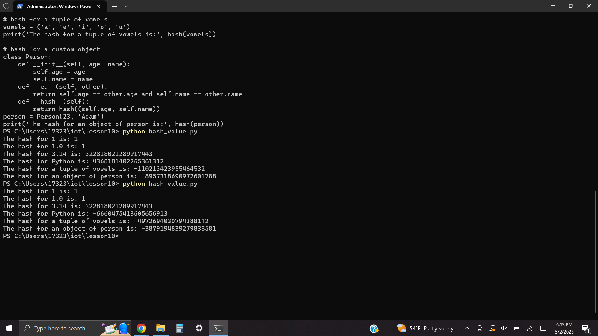
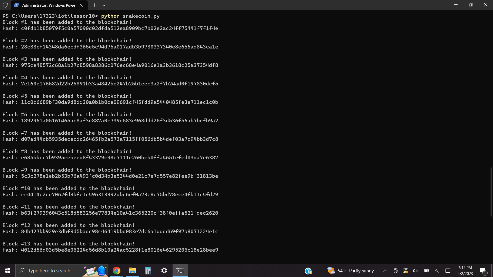
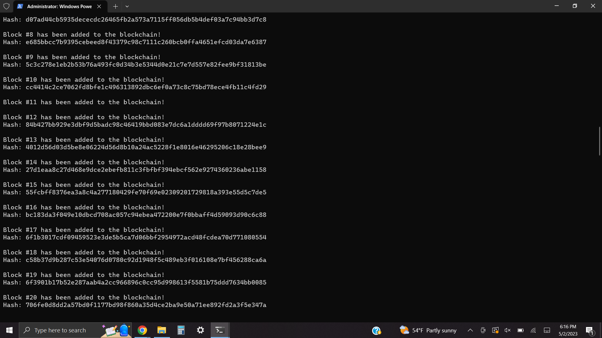
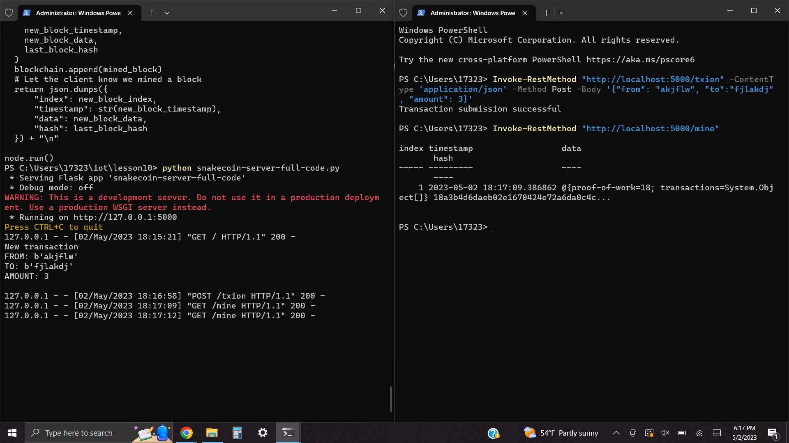
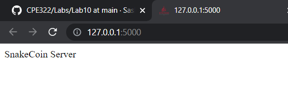
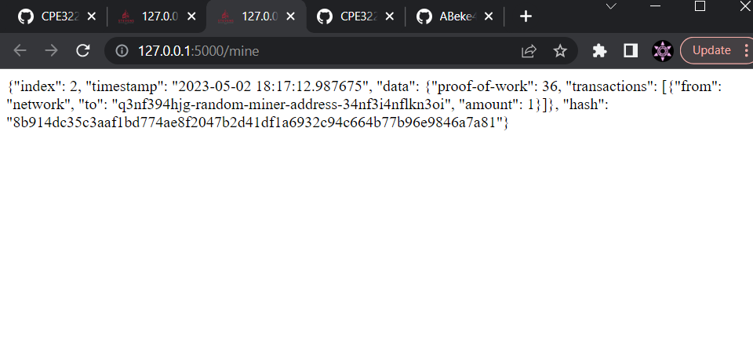
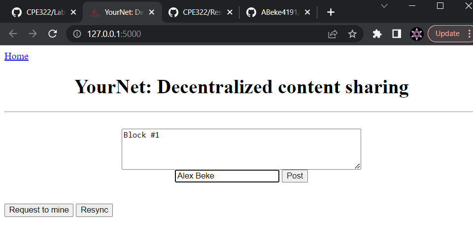
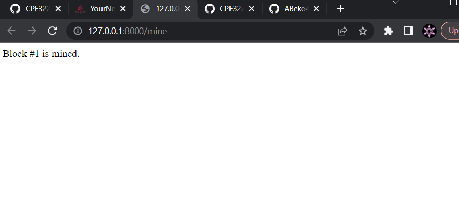
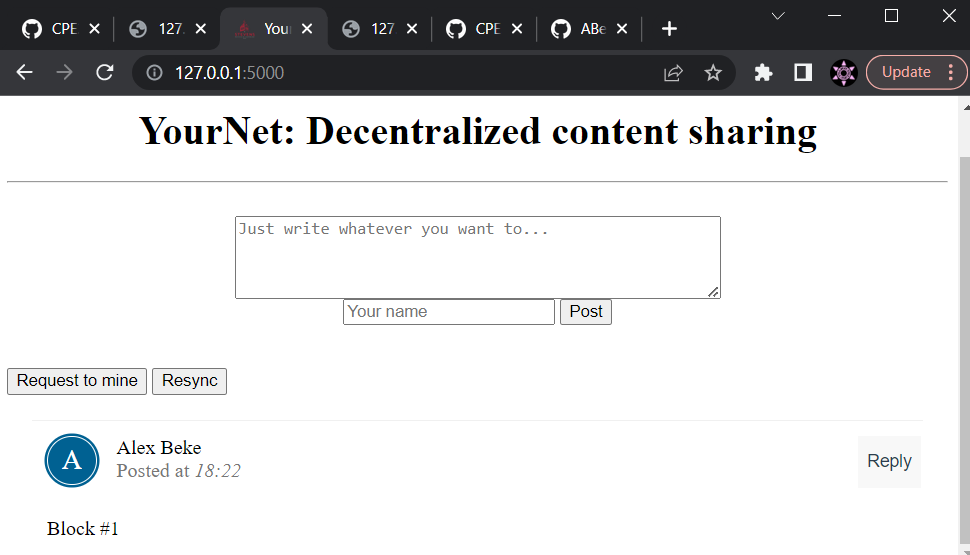

# Lab 10 Results
Created a blockchain simulation by creating a server and creating/mining a block with a mining request

## Hash value

## Snakecoin

## Snakecoin server
### Create transaction and mining a block from the terminal

### Snakecoin server page

### Snakecoin mining page

## YourNet
### Mining request

### Mined block

### Resync original page

