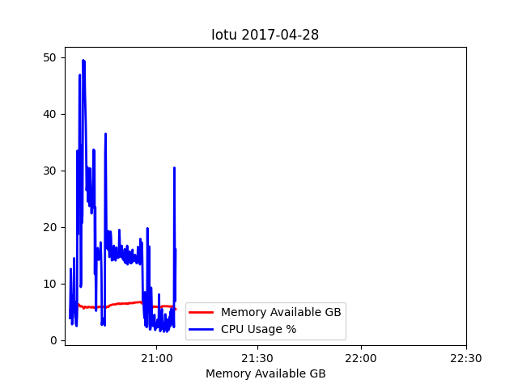
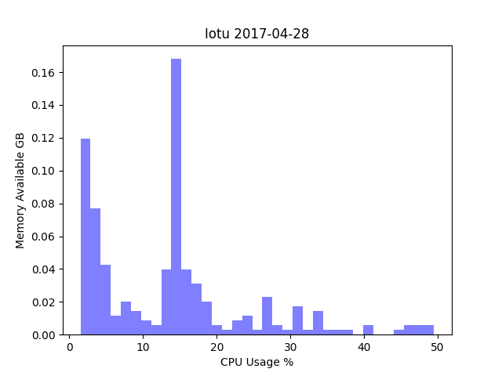
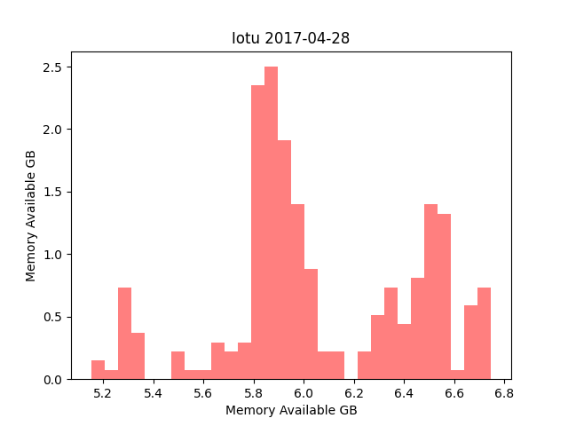
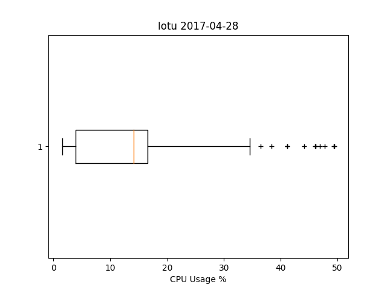
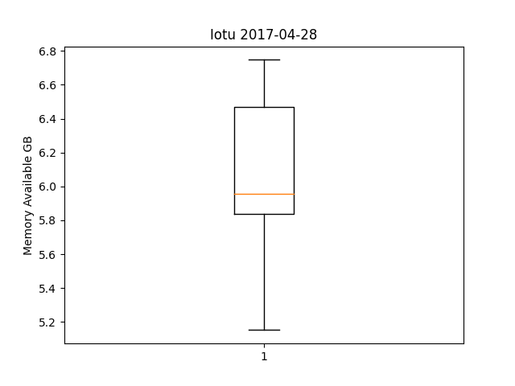
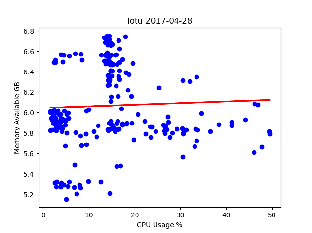
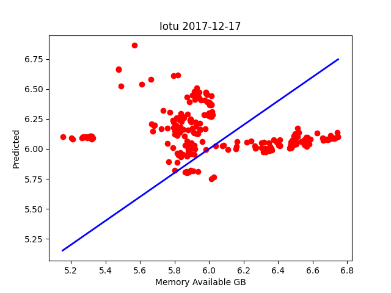

# Lab 8 Results
Using the data obtained from lab 7, created a series of different graphs and charts to showcase trends in the data collected.
## plt_final
### Time series - CPU usage & memory availability

### Histogram - CPU usage

### History - Memory availability

### Horizontal box plot - CPU usage

### Vertical box plot - Memory availability

### Scatter diagram w/ linear regression line

## plt_cv2
### Cross-validation prediction w/ memory availability as target

